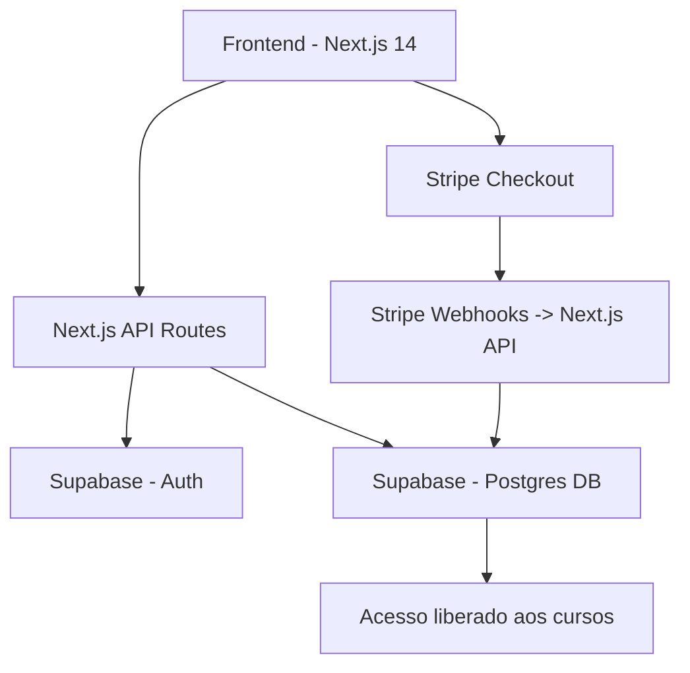

<div align="center">

# 🚀 Plataforma IMR  
### Sistema completo de cursos online com autenticação, pagamentos e painel moderno


---

## 🔥 Status: Em desenvolvimento ativo  
Última atualização: **2025**


</div>

---

# 📘 Visão Geral

A **Plataforma IMR** é um ecossistema moderno para **venda e consumo de cursos online**, com:

- **Next.js 14 (App Router, Server Actions, Route Handlers)**
- **Supabase (Auth + Banco de Dados + Realtime)**
- **Stripe (Checkout e Webhooks)**
- **TailwindCSS + Shadcn/UI (UI completa e moderna)**
- **Hospedagem inteligente na Vercel**

O sistema já possui:

✔ Cadastro de usuários  
✔ Login seguro  
✔ Envio de código de verificação por e-mail  
✔ Validação de conta obrigatória  
✔ Sistema de sessões persistentes  
✔ Dashboard do aluno  
✔ Integração completa com Stripe (checkout + webhooks)  
✔ Registro automático de compras no banco  
✔ Liberação automática de cursos após pagamento  
✔ UI moderna com shadcn e Tailwind  
✔ Páginas totalmente responsivas  
✔ Backend e frontend integrados no mesmo Next.js  
✔ Testes de API com Node, Insomnia e cURL  

---

# 🏗️ Arquitetura do Sistema



---

# ⚙️ Funcionalidades Implementadas

## 🔐 Autenticação (Supabase)

- Criação de conta com:
  - Nome
  - E-mail
  - Telefone
  - Senha
- Envio automático de código de verificação por e-mail
- Validação do usuário antes do login
- Persistência de sessão no navegador
- Logout seguro

## 📦 Banco de Dados (Supabase Postgres)

Tabelas já funcionando:

- `users`
- `profiles`
- `courses`
- `purchases`
- `email_verification_codes`

Triggers implementados:
- Atualização automática do perfil ao criar usuário
- Registro automático de compra

## 💳 Pagamentos (Stripe)

Funções prontas:

- Criação dinâmica de checkout sessions
- Redirecionamento seguro após pagamento
- Webhook funcional que:
  - Recebe confirmação do Stripe
  - Valida assinatura do evento
  - Registra compra no banco
  - Libera acesso ao curso automaticamente

## 🎨 UI e Frontend (Next.js + Tailwind + Shadcn)

Interface já estilizada:

- Navbar moderna
- Botão de login / logout
- Componentes visuais com shadcn
- Formulários de cadastro e login
- Página de cursos
- Página de checkout
- Dashboard do aluno
- Layout responsivo mobile-first

---

# 📁 Estrutura Geral do Projeto

```plaintext
app/
  ├─ api/
  │   ├─ signup/
  │   ├─ login/
  │   ├─ verify-email/
  │   ├─ stripe/
  │       ├─ checkout/
  │       ├─ webhook/
  ├─ dashboard/
  ├─ courses/
  ├─ globals.css
  ├─ layout.tsx
lib/
  ├─ supabase.ts
  ├─ stripe.ts
components/
  ├─ ui/
  ├─ forms/
scripts/
  ├─ tests/
```

---

# 🧪 Testes

Testes já feitos:

- Teste do signup via:
  - Node + fetch
  - Insomnia
  - Thunder Client
- Teste de fluxo completo:
  - Criar conta → validar e-mail → login → comprar curso → receber acesso

---

# 🚀 Tecnologias Utilizadas

| Tecnologia | Uso |
|-----------|------|
| **Next.js 14** | Fullstack (frontend + backend) |
| **Supabase** | Autenticação e banco de dados |
| **Stripe** | Pagamentos |
| **TailwindCSS** | Estilização |
| **Shadcn/UI** | Componentes |
| **Vercel** | Deploy |
| **Zod** | Validação de formulários |

---

# 📦 Como rodar o projeto

```bash
git clone https://github.com/seuusuario/plataforma-imr.git
cd plataforma-imr
npm install
npm run dev
```

---

# 📝 Licença

Projeto licenciado sob **MIT License**.

---

<div align="center">

### Desenvolvido por IMR Serviços  
**"IMR Serviços — o básico que funciona!"**

</div>
